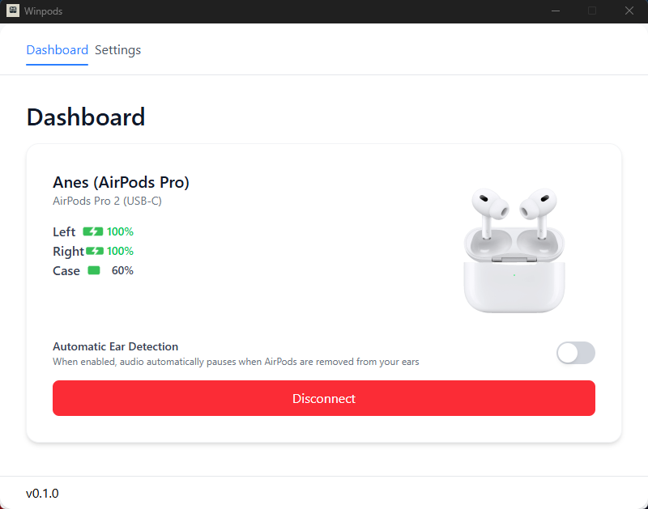

# winpods 

winpods is a lightweight desktop application that brings AirPods integration to Windows. Monitor battery levels, connection status, and control your AirPods directly from your Windows desktop.

## Features

- 🪟 Movable widget view displays the AirPods status.
- 🔋 Real-time battery monitoring for AirPods, case, and individual earbuds
- 🔌 Connection status tracking
- 🎧 Audio settings control
- 💻 System tray integration for quick access
- 🔔 Low battery notifications
- 🌙 Automatic detection when AirPods are disconnected/connected
- ⚡ Minimal resource usage

## Installation

### Download

Download the latest version from the [Releases](https://github.com/sinanovicanes/winpods/releases) page.

### Requirements

- Windows 10 or newer
- Bluetooth 5.0+ capability

## License

This project is licensed under the MIT License - see the [LICENSE](LICENSE) file for details.

---

_Note: winpods is not affiliated with Apple Inc. AirPods is a trademark of Apple Inc._
