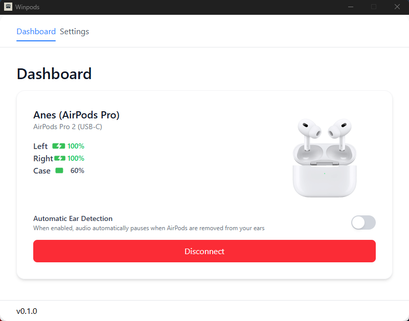
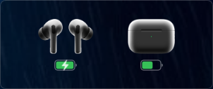

# winpods 

winpods is a lightweight desktop application that brings AirPods integration to Windows. Monitor battery levels, connection status, and control your AirPods directly from your Windows desktop.

Taskbar-first AirPods companion for Windows 11 with battery status, smart switching, and audio mode helpers.

## Features

- 🪟 Movable widget view displays the AirPods status.
- 🔋 Real-time battery monitoring for AirPods, case, and individual earbuds
- 🔌 Connection status tracking
- 🎧 Audio settings control
- 💻 System tray integration for quick access
- 🔔 Low battery notifications
- 🌙 Automatic detection when AirPods are disconnected/connected
- ⚡ Minimal resource usage

## Fork Improvement Direction

This fork focuses on making WinPods more taskbar-first for Windows 11 users.

The main goal is to show AirPods and case battery status directly from the Windows system tray/taskbar, reducing the need for a separate floating popup or widget.

### Planned Improvements

- Taskbar/system tray AirPods battery indicator
- Tooltip showing left, right, and case battery levels
- Right-click tray menu with refresh and reconnect options
- Smart Switch Helper to reconnect AirPods to this PC
- Audio mode helpers for music, gaming, and meetings
- Use laptop mic instead of AirPods mic option
- Sleep/wake auto-reconnect fix
- Cleaner Windows 11-style tray experience
- Experimental AirPods Pro noise control mode detection/switching
- Better setup and troubleshooting documentation

## Installation

### Download

Download the latest version from the [Releases](https://github.com/sinanovicanes/winpods/releases) page.

### Requirements

- Windows 10 or newer
- Bluetooth 5.0+ capability

## License

This project is licensed under the MIT License - see the [LICENSE](LICENSE) file for details.

---

_Note: winpods is not affiliated with Apple Inc. AirPods is a trademark of Apple Inc._
