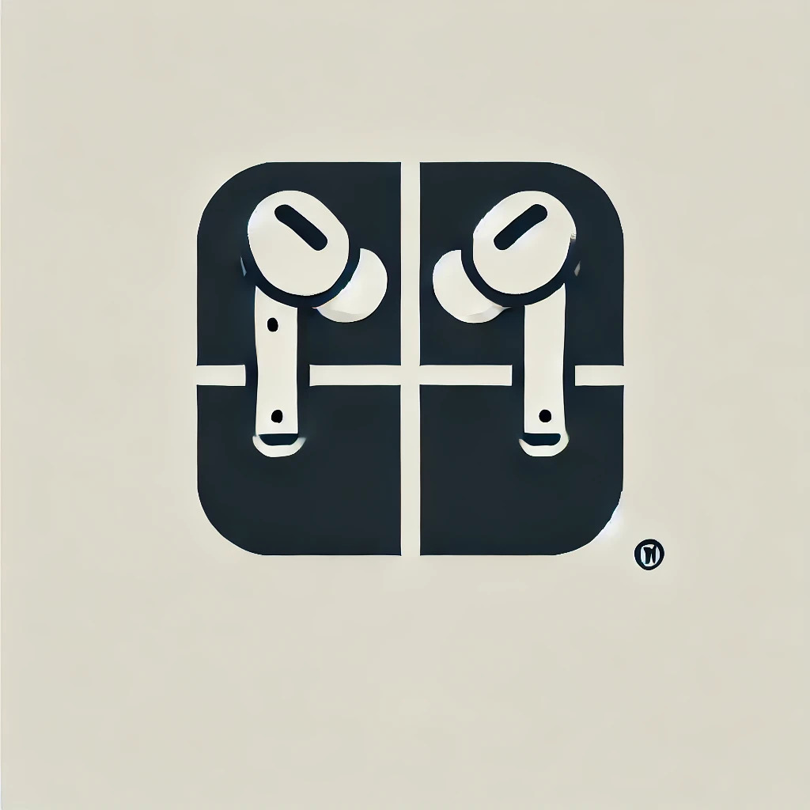
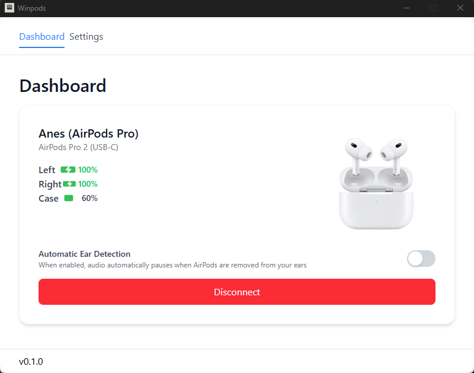
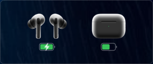

# winpods 

winpods is a lightweight desktop application that brings AirPods integration to Windows. Monitor
battery levels, connection status, and control your AirPods directly from your Windows desktop.



## Features

- 🪟 Movable widget view displays the AirPods status.
- 🔋 Real-time battery monitoring for AirPods, case, and individual earbuds
- 🔌 Connection status tracking
- 🎧 Audio settings control
- 💻 System tray integration for quick access
- 🔔 Low battery notifications
- 🌙 Automatic detection when AirPods are disconnected/connected
- 🎨 Light and dark themes, following Windows
- ⚡ Minimal resource usage



## Installation

### Download

Download the latest version from the [Releases](https://github.com/sinanovicanes/winpods/releases) page.

### Requirements

- Windows 10 or newer
- Bluetooth 5.0+ capability

## Contributing

Built with [Tauri 2](https://tauri.app) (Rust) and [SvelteKit](https://svelte.dev) (Svelte 5).

```sh
cd crates/desktop
bun install
bun run tauri dev      # the full app — Windows only
bun run dev            # the UI on its own, on any OS
```

The UI runs standalone against a mock backend, so you can work on it from macOS or Linux without a
Windows machine. See [docs/development.md](docs/development.md).

| Document | Contents |
| --- | --- |
| [CLAUDE.md](CLAUDE.md) | Orientation, conventions and the gotchas that bite |
| [docs/architecture.md](docs/architecture.md) | Crates, state ownership, event flow, threading |
| [docs/protocol.md](docs/protocol.md) | The Apple Continuity payload, byte by byte |
| [docs/development.md](docs/development.md) | Setup, cross-compiling, releasing |
| [docs/ui.md](docs/ui.md) | Design tokens and components |

## License

This project is licensed under the MIT License - see the [LICENSE](LICENSE) file for details.

---

_Note: winpods is not affiliated with Apple Inc. AirPods is a trademark of Apple Inc._
